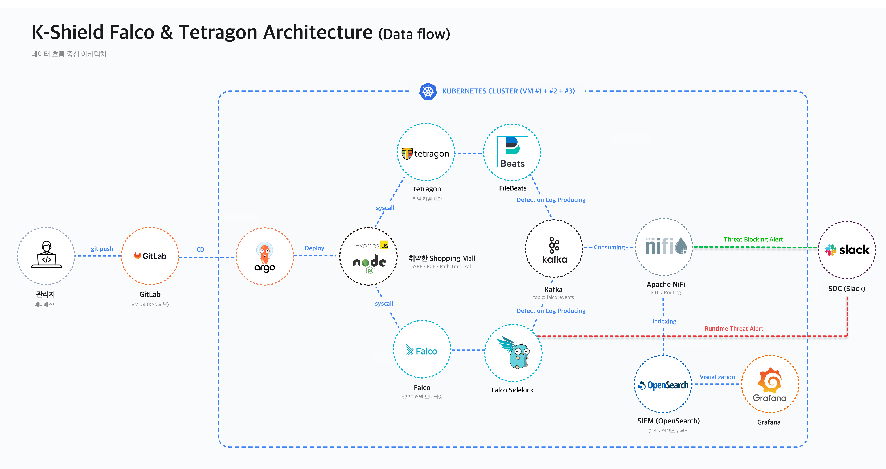
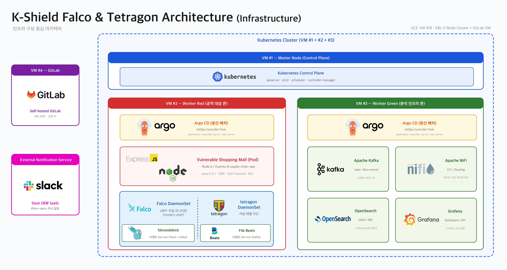
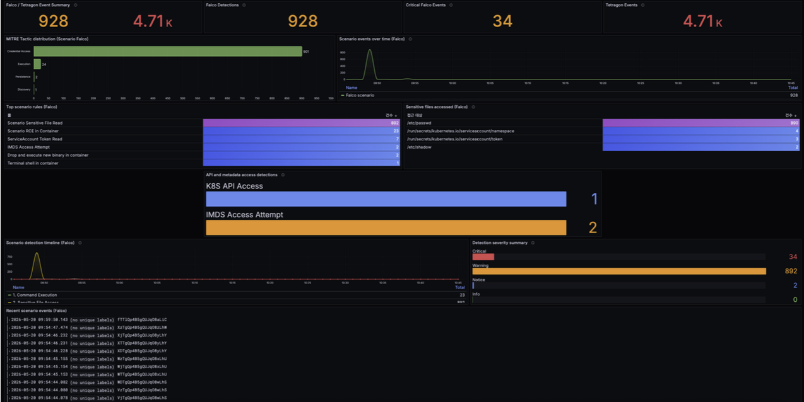
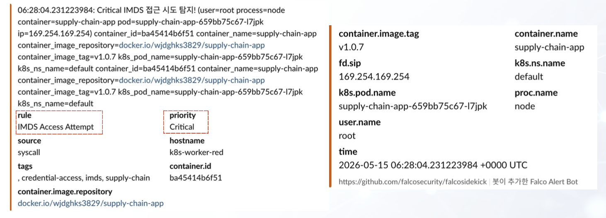
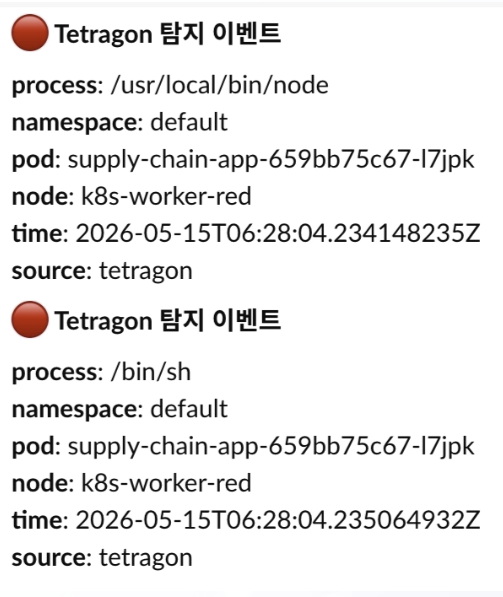
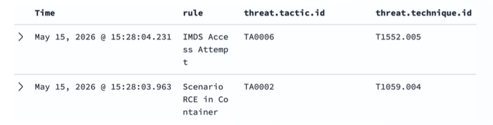
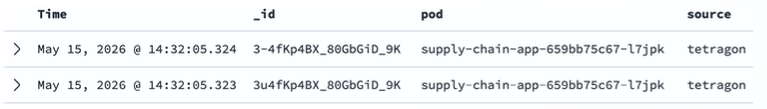

# K-Shield Junior Falco & Tetragon SecOps Pipeline

> K-Shield Junior 16기 정보보호운영 트랙 프로젝트  
> Kubernetes 환경에서 공급망 공격 이후 발생하는 런타임 위협 행위를 Falco와 Tetragon으로 탐지·차단하고, Slack·OpenSearch·Grafana 기반 SecOps 파이프라인으로 시각화한 프로젝트입니다.

<br/>

## Overview

본 저장소는 **K-Shield Junior 16기 정보보호운영 트랙 팀 프로젝트**를 개인 포트폴리오용으로 재구성한 저장소입니다.

프로젝트는 Cloud-Native 환경에서 공급망 공격으로 오염된 애플리케이션이 정상 GitOps 배포 흐름을 통해 Kubernetes Pod로 배포된 이후, 컨테이너 내부에서 발생하는 런타임 위협 행위를 실시간으로 탐지하고 고위험 행위는 차단하는 것을 목표로 합니다.

주요 흐름은 다음과 같습니다.

1. GitLab과 Argo CD 기반 GitOps 자동 배포
2. 공급망 오염이 반영된 취약 Node.js 애플리케이션 배포
3. Falco 기반 런타임 위협 행위 탐지
4. Tetragon 기반 IMDS 접근 차단
5. Slack, OpenSearch, Grafana 기반 SecOps 분석 및 시각화

<br/>

## Project Info

| 항목 | 내용 |
| --- | --- |
| 과정 | K-Shield Junior 16기 |
| 트랙 | 정보보호운영 / SecOps |
| 프로젝트명 | 공급망 공격 이후 탐지·차단 SecOps 자동화 파이프라인 구축 |
| 주제 | Falco·Tetragon 기반 Kubernetes Runtime Security Pipeline |
| 수행 기간 | 2026.05.04 ~ 2026.05.21 |
| 팀 | 2조 |
| 역할 | PM / 팀장 |
| 팀원 | 최정환, 박현수, 이준혁, 윤지환, 고성운 |

<br/>

## My Role

본 프로젝트에서 저는 **PM / 팀장**으로 참여했으며, 전체 인프라 구성과 Falco 기반 런타임 탐지 영역을 중심으로 담당했습니다.  
또한 최종 발표를 맡았고, 보고서와 발표자료 작성 과정에서는 내용 보완 및 최종 검토를 지원했습니다.

- 프로젝트 주제 선정 및 전체 방향성 논의 참여
- GCP 기반 Kubernetes 클러스터 인프라 구성
- Master / Worker Node 역할 분리 및 테스트 환경 구성
- Cilium CNI 기반 Kubernetes 네트워크 환경 구성
- GitLab, Argo CD 기반 GitOps 배포 흐름 구성
- 공급망 공격 이후 런타임 탐지 시나리오 설계 참여
- Falco 기반 런타임 탐지 룰 설계 및 적용 총괄
- RCE, 민감 파일 접근, ServiceAccount Token 접근, IMDS 접근 탐지 룰 구성
- Falco 이벤트의 Slack, Kafka, NiFi, OpenSearch, Grafana 연계 흐름 구성 지원
- MITRE ATT&CK 기반 Falco 탐지 이벤트 매핑
- 최종 보고서 및 발표자료 내용 보완, 검토 지원
- 프로젝트 최종 발표 담당

<br/>

## Architecture

### Data Flow Architecture



### Infrastructure Architecture



<br/>

## Tech Stack

| Category | Tools |
| --- | --- |
| Container / Orchestration | Docker, Kubernetes, Cilium |
| GitOps | GitLab, Argo CD |
| Runtime Detection | Falco, eBPF |
| Runtime Response | Tetragon |
| Event Pipeline | Kafka, NiFi, Filebeat |
| Storage / Search | OpenSearch |
| Visualization | Grafana, OpenSearch Dashboards |
| Alerting | Slack |
| Test Workload | Node.js, Express |

<br/>

## Scenario

### Scenario 1. Supply Chain Attack Simulation

시나리오 1은 **GitLab 저장소 및 배포 권한이 탈취된 상황을 전제**로,  
공격자가 오염된 코드와 매니페스트 변경을 정상 GitOps 배포 흐름에 태우는 과정을 재현했습니다.

본 프로젝트에서 실제 npm 악성 패키지 게시, GitLab 계정 탈취, 클라우드 자격 증명 탈취 자체는 수행하지 않았습니다.  
대신 공격자가 이미 저장소 및 배포 권한을 확보한 상황을 가정하고, 다음 흐름을 검증했습니다.

- `package.json`의 `postinstall` 스크립트가 변조된 상황 가정
- 내부 진단 기능으로 위장한 백도어성 엔드포인트 구성
- 오염된 Docker 이미지 빌드 및 Registry Push
- Kubernetes Deployment의 이미지 태그를 오염 이미지 태그로 변경
- Argo CD가 GitLab 저장소의 매니페스트 변경을 정상 변경으로 인식
- Argo CD 자동 동기화를 통해 오염된 Pod가 Kubernetes 환경에 배포되는 과정 검증

핵심 검증 포인트는 공격자가 운영 서버에 직접 접속하는 것이 아니라,  
**오염된 산출물이 정상적인 GitOps 배포 체인을 거쳐 운영 Pod까지 도달할 수 있는지 확인하는 것**입니다.

> 본 저장소에서는 자동 실행을 방지하기 위해 `postinstall` 데모 코드를 비활성화했습니다.

### Scenario 2. Runtime Detection & Blocking

오염된 Pod 내부에서 발생할 수 있는 런타임 위협 행위를 탐지·차단했습니다.

| Attack Behavior | Detection / Response |
| --- | --- |
| RCE command execution | Falco detection |
| Sensitive file read | Falco detection |
| ServiceAccount token access | Falco detection |
| IMDS access attempt | Falco detection / Tetragon inline blocking |

<br/>

## Detection Rules

### Falco

Falco는 컨테이너 내부에서 발생하는 주요 위협 행위를 탐지하는 역할을 담당했습니다.

주요 탐지 룰:

- `Scenario RCE in Container`
- `Scenario Sensitive File Read`
- `ServiceAccount Token Read`
- `IMDS Access Attempt`

Falco custom rules:

```text
security/falco/custom-rules.yaml
```

### Tetragon

Tetragon은 IMDS 접근과 같은 고위험 행위를 커널 레벨에서 차단하는 역할을 담당했습니다.

주요 차단 정책:

```text
security/tetragon/block-imds-connect.yaml
security/tetragon/block-imds-udp.yaml
```

<br/>

## Detection & Response Results

### Grafana Dashboard



### Falco Slack Alert



### Tetragon Slack Alert



### OpenSearch Falco Events



### OpenSearch Tetragon Events



<br/>

## Repository Structure

```text
K-Shield-Junior-Falco-Tetragon-SecOps
├─ app/
│  └─ kshield-shop/
│     ├─ Dockerfile
│     ├─ index.js
│     ├─ package.json
│     ├─ public/
│     └─ .gitlab-ci.yml
│
├─ gitops/
│  ├─ argocd/
│  │  └─ kshield-shop-app.yaml
│  └─ manifests/
│     ├─ deployment.yaml
│     └─ service.yaml
│
├─ security/
│  ├─ falco/
│  │  └─ custom-rules.yaml
│  └─ tetragon/
│     ├─ block-imds-connect.yaml
│     └─ block-imds-udp.yaml
│
├─ docs/
│  └─ images/
│     ├─ architecture-dataflow.png
│     ├─ architecture-infra.png
│     ├─ grafana-dashboard.png
│     ├─ falco-slack-alert.png
│     ├─ tetragon-slack-alert.png
│     ├─ opensearch-falco-events.png
│     └─ opensearch-tetragon-events.png
│
├─ README.md
└─ .gitignore
```

<br/>

## Key Files

| Path | Description |
| --- | --- |
| `app/kshield-shop/` | 공급망 공격 시나리오에 사용한 Node.js 테스트 워크로드 |
| `gitops/argocd/kshield-shop-app.yaml` | Argo CD Application 설정 |
| `gitops/manifests/deployment.yaml` | Kubernetes Deployment 매니페스트 |
| `gitops/manifests/service.yaml` | Kubernetes Service 매니페스트 |
| `security/falco/custom-rules.yaml` | Falco 커스텀 탐지 룰 |
| `security/tetragon/block-imds-connect.yaml` | IMDS TCP 접근 차단 정책 |
| `security/tetragon/block-imds-udp.yaml` | IMDS UDP 접근 차단 정책 |
| `docs/images/` | 아키텍처 및 탐지·차단 결과 이미지 |

<br/>

## How to Review

> 이 저장소는 포트폴리오용으로 재구성된 저장소입니다.  
> 전체 클러스터 구축 과정과 공격 검증 명령은 공개 저장소에 포함하지 않고, 핵심 애플리케이션·GitOps 매니페스트·탐지/차단 정책·결과 이미지를 중심으로 정리했습니다.

### 1. Review Test Workload

```bash
ls app/kshield-shop
```

### 2. Review GitOps Manifests

```bash
cat gitops/argocd/kshield-shop-app.yaml
cat gitops/manifests/deployment.yaml
cat gitops/manifests/service.yaml
```

### 3. Review Falco Rules

```bash
cat security/falco/custom-rules.yaml
```

> Falco rules should be mounted through a ConfigMap or Helm values depending on the Falco deployment method.

### 4. Review Tetragon Policies

```bash
cat security/tetragon/block-imds-connect.yaml
cat security/tetragon/block-imds-udp.yaml
```

<br/>

## MITRE ATT&CK Mapping

| Behavior | Technique |
| --- | --- |
| Command execution in container | T1059.004 - Unix Shell |
| Sensitive file access | T1552.001 - Credentials In Files |
| ServiceAccount token access | T1552.001 - Credentials In Files |
| IMDS access attempt | T1552.005 - Cloud Instance Metadata API |

<br/>

## What I Learned

이 프로젝트를 통해 단순한 애플리케이션 취약점 탐지를 넘어, Cloud-Native 환경에서 실제 운영 흐름과 연결된 보안 탐지·차단 구조를 설계하는 경험을 했습니다.

특히 공급망 공격이 정상 배포 흐름을 악용할 수 있다는 점과, 배포 이후 컨테이너 내부 행위를 런타임 관점에서 관찰해야 한다는 점을 실습 기반으로 확인했습니다.

또한 Falco와 Tetragon의 역할을 분리하여, Falco는 탐지와 이벤트 수집에 집중하고 Tetragon은 고위험 행위 차단에 활용하는 구조를 이해했습니다.

<br/>

## License

This repository is a portfolio version of a K-Shield Junior 16th SecOps team project.

For educational and portfolio purposes only.
